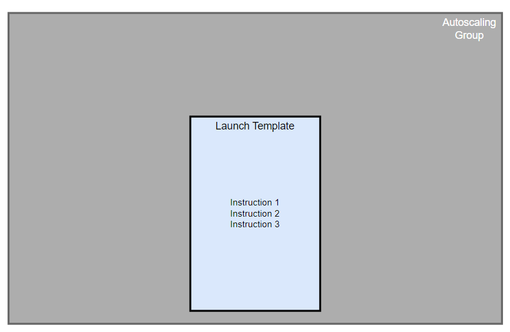
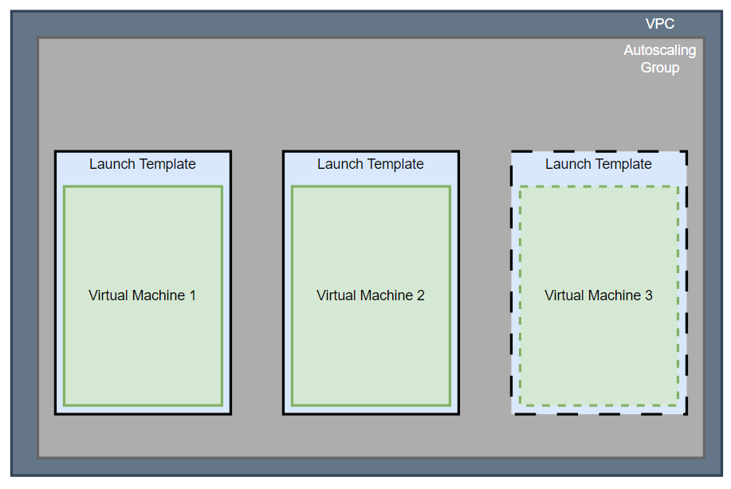
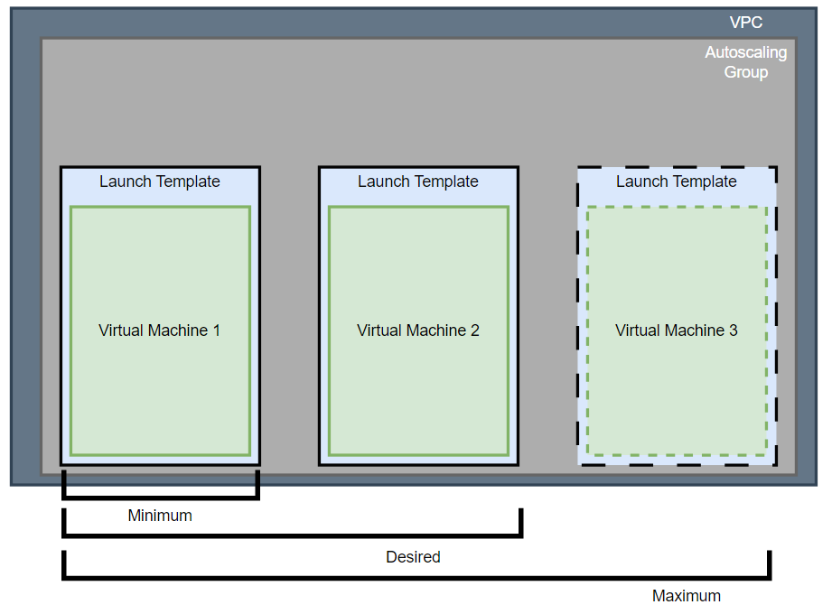
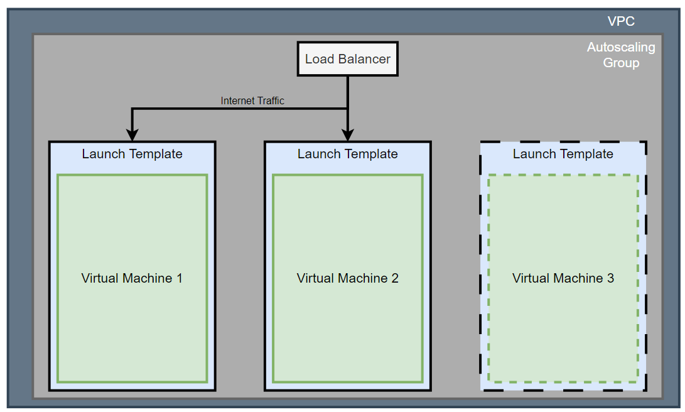
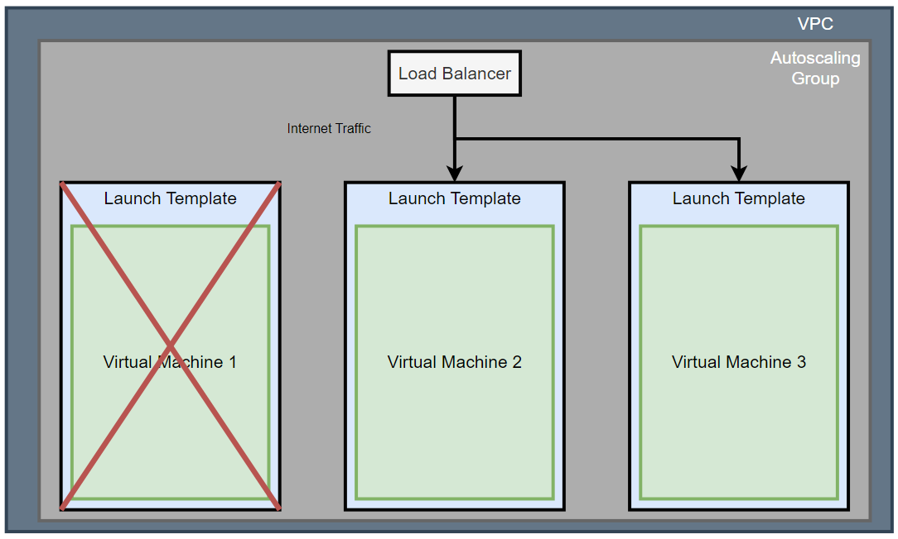
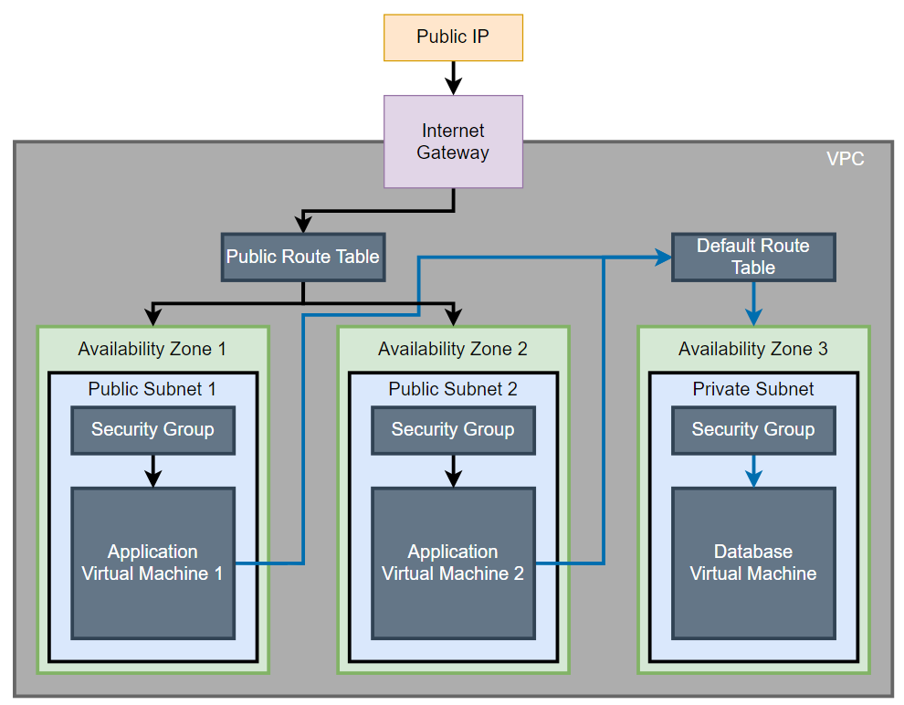

# Auto Scaling and Load Balancer Guide:

## ASG: 

I created a blank Autoscaling Group.

## Templates:

I gave it a template. This is a snapshot of the way I want my virtual machine to be configured, along with the launch settings I want it to have.

## Scaling Group

Here, I set my minimum, desired, and maximum capacity.

What does this mean?

- One machine minimum.
- Two machines desired at all times.
- At a maximum, have three machines.

## Load Balancer

I set up my internet facing application load balancer. This directs traffic evenly across the web application virtual machines.

But what if one of these machines break?

In this case, the Autoscaling Group will spin up a new machine, and the load balancer will direct traffic to this newly spun up machine:

In my case, I have set the "unhealthy" threshold to 50% CPU usage - if CPU usage exceeds that, spin up a new Virtual Machine.

The final benefit comes in the form of elasticity - if I have three machines running, but CPU usage drogs really low, the third virtual machine will be removed, autoscaling down.

## Final Setup:

What did this leave me with:

I now have:

1. Two EC2s automatically launched from templates inside public subnets, spread across different availability zones.
2. A database EC2 that is connected to the Application EC2s when they start up.
3. Autoscaling group that will spin up to three application virtual machines when traffic is high, and remove those that aren't required.
4. Load balancer that directs traffic over these application virtual machines evenly, resulting in better average CPU utilisation.