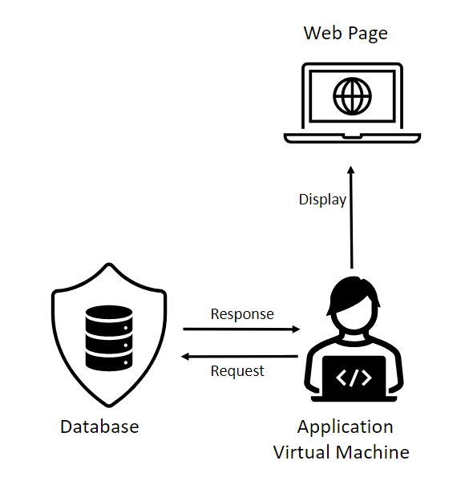
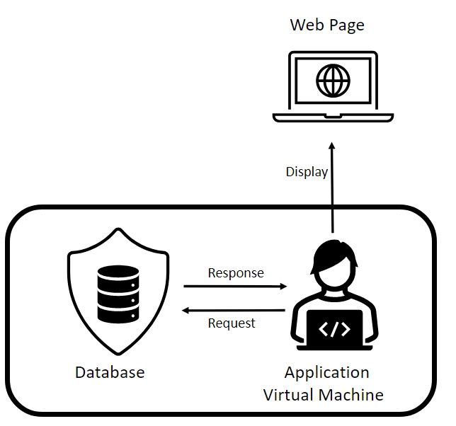
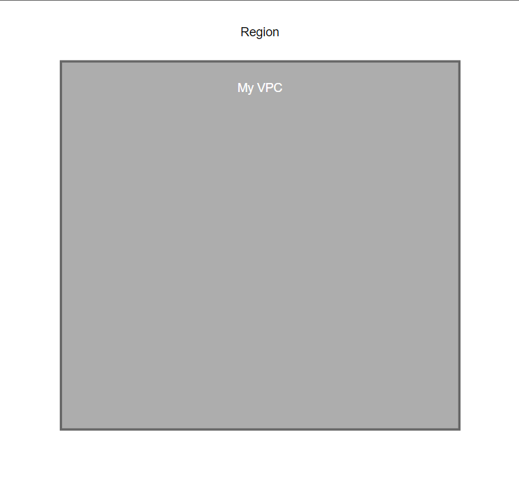
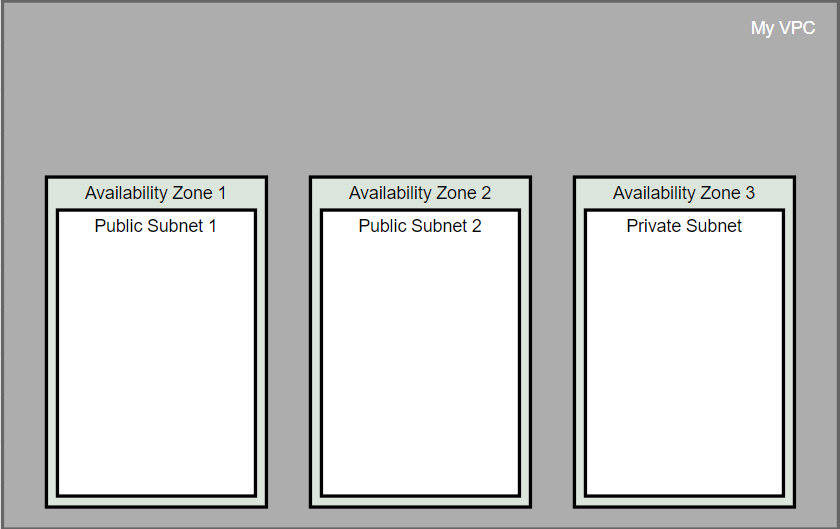
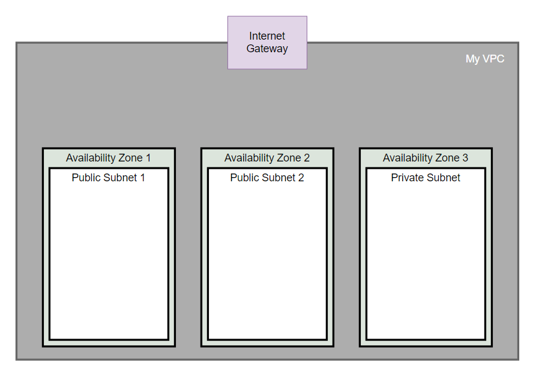
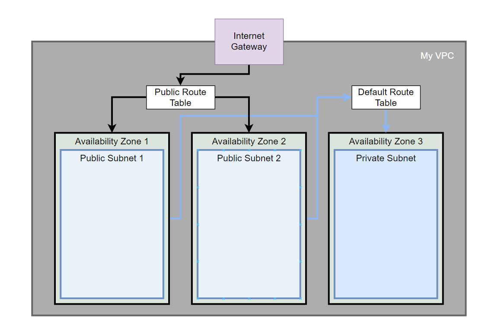
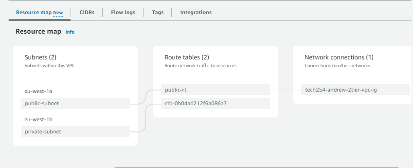
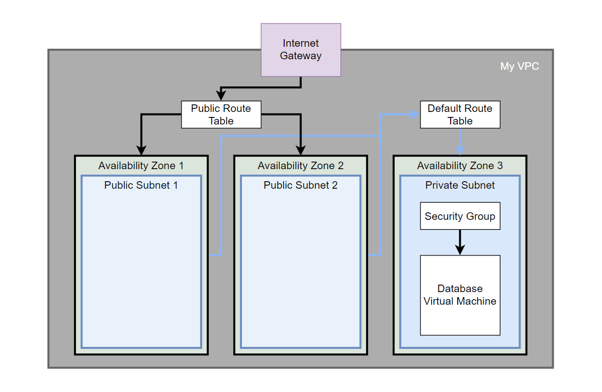

# VPC

## Default set up.

1. Sensitive database.
2. Application virtual machine.
3. Publically accessible webpage.

## Required set up.

Walls around my resources. The only thing on display is the Webpage.

# VPC

What have we done here? We've just set up the foundation for our walls.

# Subnets

Set up my three subnets: 2 public, one private.

# Internet Gateway:

I created the doorway into this VPC for the wider internet.

# Route Table:

I created Public Route Table and associated them to direct this traffic from the Internet Gateway into my public subnets. I allowed traffic to come from everywhere. This is because it'll only be going to my web page.

This leaves a default route table that only connects to the private subnet.

Simpler diagram:

## Database Setup:

Set this up manually so it has a static IP address that all my later machines can connect to, as they have specific commands.

